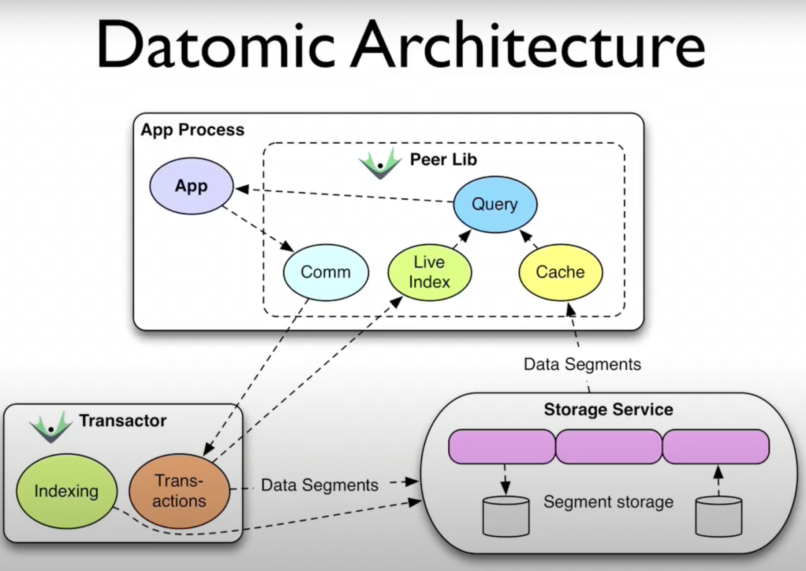
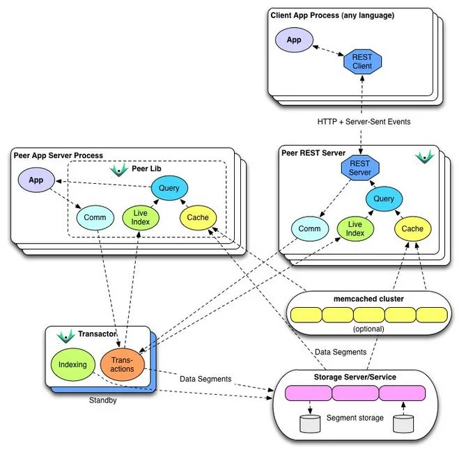

tags::  Data systems, datomic, datom, datomic, Datalog, datascript
title:: Datomic

- Datomic is a **closed-source** [database]([[Databases]]) for the JVM developed by Nu bank
	- Datomic is a distributed implementation of [[Datalog]]
	- Datomic is a *database of facts*, called [datoms](((68027a1b-5568-497f-a056-29716b8417b9)))
	- Datomic transactions add datoms, never updating or removing them
	- This means that we have an immutable past
	- Datomic’s indexes automatically support many access patterns common in SQL, column, K/V, hierarchical, and graph databases.
- [[Logseq]], itself a [[Clojure]] application, internally uses [[DataScript]], an in-browser or JVM database reverse-engineered from Datomic for its databases and queries
	- [Unlike Datomic](https://github.com/tonsky/datascript?tab=readme-ov-file#differences-from-datomic)
		- DataScript is **open-source**
		- Aimed to run on browsers
		- Does not keep track of all history by default
		- Simplified schema, not queryable
		- No schema migrations
		- No full-text search, no partitions
		- No external dependencies
- # Inspiration
	- Datomic was inspired by [Out of the Tar Pit (2006)](https://curtclifton.net/papers/MoseleyMarks06a.pdf)
		- A paper about complexity in modern software
		- The paper suggests that we build a new, stateless data system
		- Datomic is an attempt to implement that new database
			- It redefines databases as values, instead of places to get values
			- Datomic thinks of database as expanding set of facts
		- The paper identifies the root causes of many complexity in databases
			- ### States
				- Databases are inherently stateful
			- ### Same query, different result
				- This is because decision making involves >1 components of the database
				- And these components may behave weirdly on race condition
			- ### The database is *over there*
				- Databases are shared by multiple consumers
			- ### Poor definition of *updates*
				- The new replaces the old?
					- Or write a new value to an immutable log?
				- Visibility?
					- Do other programs see these updates being updated?
					- Can they choose if they want to lock on reads?
- # Components
	- > Datomic delegates storage to external services
	  >
	  > This means we can integrate Datomic with any storage, from simple file systems, to other databases
	- 
	- ## Transactor
		- Transactor is the writer part of Datomic
		- Runs separately from the application (that has peers), with some connection
	- ## Peers
		- Peers are "readers", and maintain live indexes
		- Can be scaled horizontally
		- When reading from storage, peers require no coordination with the Datomic transactor
- # EDN, Datomic, and Datalog
	- [Logseq queries](https://docs.logseq.com/#/page/advanced%20queries) use [Datomic](https://www.datomic.com/), a dialect of [Datalog](https://www.learndatalogtoday.org/)
	- [Datalog](https://en.wikipedia.org/wiki/Datalog) is a *declarative* logical programming language
		- A Datalog program consists of:
			- Facts - which are statements held to be *true*
				- Below are 2 facts:
				  ```datalog
				  parent(xerces, brooke).
				  parent(brooke, damocles).
				  ```
				- 1st fact: Xerxes is a parent of Brooke,
				- 2nd fact: Brooke is a parent of Damocles
			- Rules - how to deduce (not derive!) new facts from known facts
				- ```datalog
				  ancestor(X, Y) :- parent(X, Y).
				  ancestor(X, Y) :- parent(X, Z), ancestor(Z, Y).
				  ```
	- In Datomic, **Datalog query is written in [[EDN]]**
		- Logseq config is also in EDN: config.edn
	- Datomic is a [database]([[Databases]]) implementation with simplicity scalability in mind
	- Datomic presents data as if it's in-memory, as a graph of attributes
	- Read more on InfoQ: https://www.infoq.com/articles/Architecture-Datomic/
	  
- # Datomic datom
  id:: 68027a1b-5568-497f-a056-29716b8417b9
	- In Datomic, data model is based around *atomic facts* called datoms
	- Datoms are 4-element tuples:
		- Entity ID
		- Attribute ([[EDN]] keyword)
		- Value
		- Transaction ID
	- A *database* in Datomic is thus just a set of datoms:
	  ```edn
	  [ 167    :person/name     "James Cameron"    102  ]
	  [ 234    :movie/title     "Die Hard"         102  ]
	  [ 234    :movie/year      1987               102  ]
	  [ 235    :movie/title     "Terminator"       102  ]
	  [ 235    :movie/director  167                102  ]
	  ```
		- *Combining facts*
			- We can see that entity ID `234` is shared by datoms on line 2 and 3, implying that they both are facts for the same entity `234`.
			- This means that the entity `234` has attribute `:movie/title` with value `"Die Hard"`, and attribute `:movie/year` with value `1987`
		- *Foreign keys*
			- On line 5, we can see that the `:movie/director` attribute of e-id `235` is 167
			- And that `167` is just e-id for some entity with attribute `:person/name` equal to `"James Cameron"`
			- In [[SQL]] way of thinking, this is like linking a field in table `movies` with a foreign key set to some primary key in table `persons`
		- We see that transaction ID `102` is shared by all datoms here, implying they were written as part of the same database transaction
	- Even Datomic indexes are datoms - they are sorted set of datoms
	- Datomic indexes that sort by entity, attribute, value, and transaction is called EVAT
- # Datomic query
	- A Datomic query is a [[EDN]] vector
	- The query vector always starts with keyword `:find`
	- After `:find` comes one or more *pattern variables*, which are EDN symbols starting with `?`
	- After that comes the `:where` clause with its *data patterns* to match against
	- ## Datomic data patterns
	  id:: 68027fd8-5cfb-40ab-9293-312aecb03bda
		- The *data patterns* are just datoms, with some elements replaced with *pattern variables*
		- Wildcard `_` can be used to ignore matching (i.e. matches against all)
			- Note that omitting later parts of the data patterns also match against all, e.g.
			  ```edn
			  [?e :person/name "Mr T" _]
			  ```
			  Is the same with
			  ```edn
			  [?e :person/name "Mr T"]
			  ```
		- The query below finds all entity IDs (`?e`) whose attribute `:person/name` matches `"Ridley Scott"`
		  ```edn
		  [
		   	:find ?e
		  	:where
		  		[?e :person/name "Ridley Scott"]
		  ]
		  ```
		- This one gets title for movie with e-id `234`
		  ```edn
		  [
		   	:find ?t
		  	:where
		  		[234 :movie/title ?t]
		  ]
		  ```
		- This one gets *all* e-ids for 1987 movies
		  ```edn
		  [
		   	:find ?e
		  	:where
		  		[?e :movie/year 1987]
		  ]
		  ```
		- This one gets all `:movie/title` attribute values available in the database:
		  ```edn
		  [
		   	:find ?t
		  	:where
		  		[_ :movie/title ?t]
		  ]
		  ```
	- ## Multiple data patterns
		- Multiple *data patterns* may follow `:where` keyword
		- **Example 1**: Find titles of movies made in 1987
		  ```edn
		  [
		  	:find ?t
		   	:where
		  		[?e :movie/year 1987]
		  		[?e :movie/title ?t]
		  ]
		  ```
			- The pattern variable `?e` is used in both data patterns, serving as the connection between the 2 data patterns
			- This means that `?e` is bound to the same variable, so all `?t` returns must comes from entity IDs whose attribute `:movie/year` is `1987`
		- The order of data patterns do not matter to the result (the result is the same), but also do matter for performance considerations
		- **Example 2**: Find out everyone who's starred in `"Lethal Weapon"`
		  ```edn
		  [
		  	:find ?n
		   	:where
		  		[?m :movie/title "Lethal Weapon"]
		  		[?m :movie/cast ?p]
		          [?p :person/name ?n]
		  ]
		  ```
	- **Data patterns** are actually 5-member tuples, with the first element being the database itself. This first element is usually implicitly dropped
	  id:: 680289b6-ea47-434b-80ae-bb6268c3a69e
	  ```edn
	  [<database> <entity-id> <attribute> <value> <transaction-id>]
	  ```
	- ## Query for attributes
	  id:: 680291ef-e7a3-4747-8c42-1a735cb33c75
		- Datom attributes are also entities stored in the Datomic database
		- This means that we can find out all attributes associated with an entity
		- Let's start with this query, which returns all e-ids to all attributes for all entities with attribute `:person/name`, aka a person
		  ```edn
		  [:find ?attr
		   :where 
		   [?p :person/name]
		   [?p ?attr]]
		  ```
		  |`?attr`|
		  | ---| 
		  | `70` |
		  | `69` |
		  | `68` |
		- To get the attribute keywords, we'll lookup `:db/ident` attribute which stores the keyword (database identity) for the attribute:
		  ```edn
		  [:find ?a ?attr
		   :where
		   [?p :person/name]
		   [?p ?a]
		   [?a :db/ident ?attr]]
		  ```
		  | `?a` |  `?attr` |
		  | --- | --- |
		  | `70` | `:person/death` |
		  | `69` | `:person/born` |
		  | `68` | `:person/name` |
	- ## Query for transactions
		- Transaction IDs are the 4th element (or 5th if you count the usually omitted database element)
		- Each transaction is also stored as a datom within the database
		- This means that we can do:
		  ```edn
		  [:find ?timestamp
		   :where
		   [?p :person/name "James Cameron" ?tx]
		   [?tx :db/txInstant ?timestamp]
		  ]
		  ```
		  to get the timestamp of the insertion of James Cameron name into our database
	- ## Parameterized data patterns
		- Input parameters eliminate hard coded values like `"Lethal Weapon"`
		- The `:in` clause helps bind input parameters into the data patterns
		- We can have any number of input parameters
		- ### Example 1
			- We have this non-parameterized data patterns, which has hard-coded string `"Sylvestor Stallone"` as actor name:
			  ```edn
			  [:find ?title
			   :where
			   [?p :person/name "Sylvester Stallone"]
			   [?m :movie/cast ?p]
			   [?m :movie/title ?title]
			  ]
			  ```
			- But we also want to reuse this query with other actors, probably `"Steven Seagal"`:
			  ```edn
			  [:find ?title
			   :in $ ?name
			   :where
			   [?p :person/name ?name]
			   [?m :movie/cast ?p]
			   [?m :movie/title ?title]
			  ]
			  ```
				- Here, this query takes 2 arguments
					- [`$`, which is the database itself](((680289b6-ea47-434b-80ae-bb6268c3a69e)))
						- This means that we could rewrite the parameterized query above as:
						  ```edn
						  [:find ?title
						   :in $ ?name
						   :where
						   [$ ?p :person/name ?name]
						   [$ ?m :movie/cast ?p]
						   [$ ?m :movie/title ?title]
						  ]
						  ```
					- `?name`, which will be the input for actor name
					  id:: 680288ce-44a1-4435-9733-a9d48e890ed0
						- Here `?name` is bound to scalar (string) values
						- But it's possible to bind it to
							- Scalar (e.g. string and number like in this example)
							- [Tuples](((68028b14-8cf4-41af-b92f-5a9532432a41)))
							- [Collections](((68028cb3-be06-41c0-9610-6083df1735e7)))
							- [Relations](((68028e85-f169-4642-851a-e217c852c2c2)))
				- In pseudo-language, the query engine `q` is performing something like:
				  ```lisp
				  (q query db "Steven Seagal")
				  ```
				  Where `query` is the query above, `db` is the database, and `"Steven Seagal"` as input `?name`
		- ### Example 2
			- Get all [attributes](((680291ef-e7a3-4747-8c42-1a735cb33c75))) of a movie with matching title
			- ```edn
			  [:find ?attr
			   :in $ ?title
			   :where
			    [?m :movie/title ?title]
			    [?m ?a]
			    [?a :db/ident ?attr]
			  ]
			  ```
		- ### Tuple input parameter
		  id:: 68028b14-8cf4-41af-b92f-5a9532432a41
			- We can write input parameter as *a single tuple* `[?director ?actor]`:
			  ```edn
			  [:find ?title
			   :in $ [?director ?actor]
			   :where
			   [?d :person/name ?director]
			   [?a :person/name ?actor]
			   [?m :movie/director ?d]
			   [?m :movie/cast ?a]
			   [?m :movie/title ?title]
			  ]
			  ```
			- This'll help destructure *a single input vector* `["James Cameron" "Arnold Schwarzenegger"]` into the tuple elements
				- String `"James Cameron"` will be destructured into `?director`
				- String `"Arnold Schwarzenegger"` will be destructured into `?actor`
			- Tuple destructuring is an alternative to using separate inputs:
			  ```edn
			  [:find ?title
			   :in $ ?director ?actor
			   :where
			   [?d :person/name ?director]
			   [?a :person/name ?actor]
			   [?m :movie/director ?d]
			   [?m :movie/cast ?a]
			   [?m :movie/title ?title]
			  ]
			  ```
				- In this case, **the query must be called with 2 variables (excl. the database `$`)** - a string for `?director` and another for `?actor`
		- ### Collections input parameter
		  id:: 68028cb3-be06-41c0-9610-6083df1735e7
			- *Collections* can be used to implement a **logical `OR`**
			- *Collections* are denoted with literal ellipsis `...`
			- ```edn
			  [:find ?title
			   :in $ [?director ...]
			   :where
			   [?p :person/name ?director]
			   [?m :movie/director ?p]
			   [?m :movie/title ?title]
			  ]
			  ```
			- In the above example, if we call the query with *a tuple containing 2 director names* `["James Cameron" "Ridley Scott"]`, then it'll get all titles for movies directed by either of the 2 directors
			- > Calling this query with scalar input `"James Cameron"` will get empty results
			  > And 2 scalar inputs will also return empty result: `"James Cameron" "Ridley Scott"`
		- ### Relations input parameter
		  id:: 68028e85-f169-4642-851a-e217c852c2c2
			- A *relation* is **a set of tuples**
			- *Relations* are the most powerful form of input binding
			- A relation lets us define some simple relationship
			- For example, a relation input parameter is defined as:
			  ```edn
			  [movie-title box-office-earnings]
			  ```
			- And we have this query:
			  ```edn
			  [:find ?title ?box-office
			   :in $ ?director [[?title ?box-office]]
			   :where
			   [?p :person/name ?director]
			   [?m :movie/director ?p]
			   [?m :movie/title ?title]
			  ]
			  ```
				- > Note: `?box-office` does not appear in the [`:where` clause data patterns](((68027fd8-5cfb-40ab-9293-312aecb03bda)))
				- Note how it has 2 inputs
					- Input 1: Scalar `?director`
					- Input 2: Relation `[?title ?box-office]`
			- Then, if we supply these tuples as input 2:
			  ```edn
			  [
			   ["Die Hard" 140700000]
			   ["Alien" 104931801]
			   ["Lethal Weapon" 120207127]
			   ["Commando" 57491000]
			  ]
			  ```
				- This relation provides a relationship between some movie titles and some box office values, which existed outside of the database
				- The movie titles, i.e. the 1st element of the tuple, will be destructured into `?title`, while the 2nd element into `?box-office`
			- This means that, given the relation above and `?director` equal to `"Ridley Scott"`, we'll be able to query box office values of all Ridley Scott movies in the relation
				- If the relation supplied lacks any titles by Ridley Scott, then the query returns empty
	- ## Predicates
	  id:: 680296c3-f38e-4fd3-aa52-432ce2486bc6
		- With data patterns, we can match against something with equal-to operations
		- But we have not yet compared the values (which one is greater, etc.)
		- This is where predicates come in
			- Predicates help with filtering
			- Predicates that returns *truthy* values are matched
				- A truthy value is non-nil, non-false
			- ```edn
			  [:find ?title
			   :where
			   [?m :movie/title ?title]
			   [?m :movie/year ?year]
			   [(< ?year 1984)]
			  ]
			  ```
			- The last `:where` clause, `[(< ?year 1984)]`, is a *predicate*
			- It returns true if `?year` value is less than 1984
		- Simple comparisons can be as operations right away, like `<`, `<=`, `=`, `>=`, `>`,  and `not=`
			- ```lisp
			  ; Lisp-style examples
			  (< 10 5)] ; false
			  (> 10 5) ; true
			  (not= 10 1) ; true
			  (= 10 (+ 5 5)) ; true
			  ```
		- Any *Java or Clojure methods* can be also be used as *predicates*
			- An example would be [Java method `startsWith` for type `String`](https://docs.oracle.com/javase/8/docs/api/java/lang/String.html#startsWith-java.lang.String-)
			  ```edn
			   (.startsWith ?name "M")
			  ```
		- Any *Clojure functions* can serve as *predicates*, but must contain fully-qualified namespace paths:
		  ```edn
		  (my.namespace/awesome? ?movie)
		  ```
	- ## Transformation
	  id:: 680299ac-da59-4d1f-995b-cad9d2175145
		- Transformation is purely functional transformation of the query *pattern variables*
		- A transformation function clause is in the form:
		  ```edn
		  [(<fn> <arg1> <arg2> ...) <result-binding>]
		  ```
		  The return value of the call is bound to `<result-binding>`
		- The binding variable, [like with input parameters](((680288ce-44a1-4435-9733-a9d48e890ed0))), could be
			- Scalar
			- Tuple
			- Collection
			- Relationship
		- For example, if we have this Clojure function at namespace path `tutorial.fn/age`:
		  ```clojure
		  (defn age [birthday today]
		    (quot (- (.getTime today)
		             (.getTime birthday))
		          (* 1000 60 60 24 365)))
		  ```
		- Then we can use it to transform birth years (stored in our database) into age by using it to bind the function's return value to our pattern variable:
			- **Example 1**: Given a person's name and today as time, compute that person's age
			  ```edn
			  [:find ?age
			   :in $ ?name ?today
			   :where
			   [?p :person/name ?name]
			   [?p :person/born ?born]
			   [(tutorial.fns/age ?born ?today) ?age]
			  ]
			  ```
			- **Example 2**: Given a target age and today as time, get all person's names whose age matches target age:
			  ```edn
			  [:find ?name
			   :in $ ?age ?today
			   :where
			     [?p :person/name ?name]
			     [?p :person/born ?born]
			     [(tutorial.fns/age ?born ?today) ?age]
			  ]
			  ```
		- Transformations **cannot be nested**:
		  ```edn
		  [(f (g ?x)) ?a]
		  ```
		  Instead, we must bind the result to some temporary variable:
		  ```edn
		  [(g ?x) ?t]
		  [(f ?t) ?a]
		  ```
	- ## Aggregate
	  id:: 68029dc3-5659-4fe5-9037-1f9f2e96c1ca
		- Simple aggregations like `sum`, `max`, `min` are readily available in the `:find` clause:
		  ```edn
		  [:find (max ?rating)
		   :where
		   [?m :movie/director "James Cameron"]
		   [?m :movie/rating ?rating]
		  ]
		  ```
		- An aggregate function collects value from multiple datoms and returns
			- Single value
				- `sum`, `max`, `count`, etc. returns a single value
				- Find newest movie
				  ```edn
				  [:find (max ?year)
				   :where
				   [_ :movie/year ?year]
				  ]
				  ```
				  | `(max ?year)` |
				  | ---- |
				  | `2003` |
				- Count all movie entities in the database
				  ```edn
				  [:find (count ?m)
				   :where
				   [?m :movie/title _]
				  ]
				  ```
				  | `(count ?m)` |
				  | --- |
				  | `20` |
				  Or we could count them by titles:
				  ```edn
				  [:find (count ?t)
				   :where
				   [_ :movie/title ?t]
				  ]
				  ```
				  | `(count ?m)` |
				  | --- |
				  | `20` |
			- Multiple values
				- Some aggregates can be formed to return >1 values
				- `(min n ?v)` returns a collection of at most `n` values of `?v`, in this case, the `n` smallest values
				- Find release year of the 4 oldest movies:
				  ```edn
				  [:find (min 4 ?year)
				   :where
				   [_ :movie/year ?year]
				  ]
				  ```
				  | `?year` |
				  | --- |
				  | `[1979 1981 1982 1984]` |
					- Note that we **cannot **do
					  ```edn
					  [:find (min 4 ?year) ?title
					   :where
					   [?m :movie/year ?year]
					   [?m :movie/title ?title]
					  ]
					  ```
					- This will simply finds all movie titles, and `(min 4 ?year)` will return 1-element tuple containing 1 value - the year of the movie title:
					  | `(min 4 ?year)` | `?title` |
					  | ---- | ---- | ---- |
					  | `[1979]` | `"Alien"` |
					  | `[1986]` | `"Aliens"` |
					  | `[1995`] | `"Braveheart"` |
					  | `[1985]` | `"Commando"` |
					  | `[1988]` | `"Die Hard"` |
					  | `[1982]` | `"First Blood"` |
					  | `[1987]` | `"Lethal Weapon"` |
					  | `[1989]` | `"Lethal Weapon 2"` |
	- ## Rules
		- [Datomic rules](https://docs.datomic.com/query/query-data-reference.html#rules) are like program functions - named reusable chunk of logic
		- We can compose a rule, give it a name, and use it in our queries
		- Rules can contain data patterns, ((68029dc3-5659-4fe5-9037-1f9f2e96c1ca)), ((680299ac-da59-4d1f-995b-cad9d2175145)), and ((680296c3-f38e-4fd3-aa52-432ce2486bc6))
		- **A rule is a list of lists**, with a very simple form:
		  ```edn
		  [(head-vector) [body1] [body2] ...]
		  ```
			- 1st vector is called a *rule head*
				- It's possible to use `[ ]` to enclose the rule head vector
				- But it's convention to use `( )` to enclose the head, for visual comfort
				- The head is akin to function signature: it specifies its name and rule arguments
			- The rest is informally called *rule body*
			- Definition:
			  ```
			  rule                       = [ [rule-head clause+]+ ]
			  rule-head                  = [rule-name rule-vars]
			  rule-name                  = plain-symbol
			  rule-vars                  = [variable+ | ([variable+] variable*)]
			  ```
		- To use rules, *write the head* of the rules instead of the data patterns
		- ### Example 1
			- Original query (without rules):
			  ```edn
			  [:find ?name
			   :where
			   [?p :person/name ?name]
			   [?m :movie/cast ?p]
			   [?m :movie/title "The Terminator"]]
			  ```
			- Rule `actor-movie`
			  ```edn
			  [(actor-movie ?name ?title)
			   [?p :person/name ?name]
			   [?m :movie/cast ?p]
			   [?m :movie/title ?title]]
			  ```
				- This rule is named `actor-movie`
				- This rule can be used for both input and output, and thus can be used to:
					- Find movie titles, given an actor name
					- Find actor name, given a movie title
					- Find all combinations of actor-movie mapping, given nothing
			- New query, replacing data patterns with rule
			  ```edn
			  [:find ?name
			   :in $ %
			   (actor-movie ?name "The Terminator")]
			  ```
			- The `%` symbol in `:in` represent the rule
		- We can use >1 rules, collect their result into a vector, before passing it on to the query like usual:
		  ```edn
		  [
		  	[(head-1) [...] [...] [...]]
		  	[(head-2) [...] [...] [...]]
		  ]
		  ```
		  Which might look something like this
		  ```edn
		  [[(rule-a ?a ?b)
		    ...]
		   [(rule-b ?a ?b)
		    ...]
		   ...]
		  ```
			- With this, rules can also be composed to implement **logical `OR`**
				- Rules `associated-with` can be used multiple times:
				  ```edn
				  [[
				    (associated-with ?person ?movie)
				    [?movie :movie/cast ?person]]
				   [(associated-with ?person ?movie)
				    [?movie :movie/director ?person]
				  ]]
				  ```
				  Foo
				  ```edn
				  [:find ?name
				   :in $ %
				   :where
				   [?m :movie/title "Predator"]
				   (associated-with ?p ?m)
				   [?p :person/name ?name]]
				  ```
		- ### Example 2
			- Rule `movie-year`, which matches movie titles with release year
			  ```edn
			  [[(movie-year ?title ?year)
			   	[?m :movie/title ?title]
			    	[?m :movie/year ?year]]]
			  ```