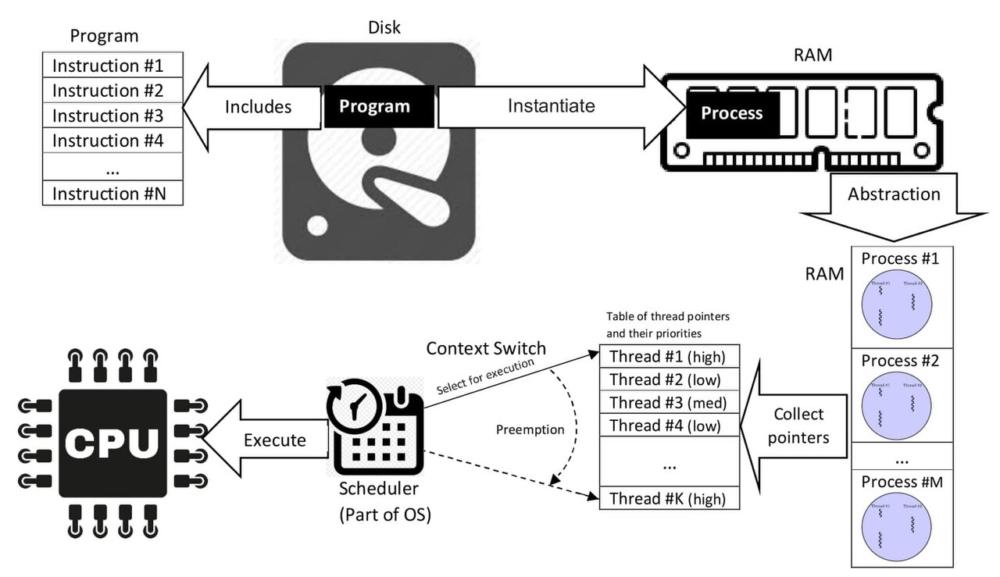

# Operating systems
	- OS runs and manages other program and hardware resources, such as [[Memory]] and disks
	- Before software OS, there used to be a human operator who loaded and operated the computer
	- Early OS was tied to its hardware, and usually came in the form of a machine-specific standard library (i.e. providing functions for I/O and display)
	- Main jobs for modern OSes are
		- Initializing memory and other objects for other programs
		- Manage hardware
		- Manage loading and running of programs ([[Process]])
- # Time-sharing operating systems
	- Before TSOS, the computer could only run 1 program at a time
		- i.e. the computer loads a program into memory, and proceeds to execute it until the program exits.
	- TS allows the CPU to *virtually* executes more than 1 program at a time.
		- This works by isolating each running program into a *process*, and then make the CPU switches execution between these processes.
	- Robust TS systems have 2 main parts: *mechanisms* and *policies*
		- **Mechanisms** are low-level machinery that control TS
			- e.g. **context switching**
		- **Policies** sit on top of mechanisms, and determine how to perform the mechanisms.
			- Policies are high-level intelligence the OS uses to determine how to do TS with a particular *mechanism*.
			- Policies usually use current or historical data, like `given the current system state, and that programs A has been hogging CPU for x minutes, what program should run if the current system is optimizing for memory`
			- e.g. if our underlying mechanism is *context switching*, then we can implement a *scheduler* policy to determine when and how to switch contexts.
		- You can think of *mechanisms as how* questions, and *policies as which* questions
		- Mechanisms and policies are best designed separated
	- ## [[Process]]
		- A process is the representation of a running program as seen by the OS
		- A process may be running on 1 or more kernel [[Threads]]
			- Thus, a process is more heavyweight and costly to create and destroy than threads
		- Processes **own** resources allocated by the OS, not [[Threads]]
		- Process isolation mean that each process has its own address space and file resources unless programmed so explicitly
		- Unlike some [[Threads]], processes are mostly *preemptively* mutitasked
		- ## From programs to processes
			- From program to process and then threads
			  logseq.order-list-type:: number
			  
			- OS loads *executable program bytes* from disk to memory
			  logseq.order-list-type:: number
			- OS allocates some memory, runtime stack, to setup the program for running
			  logseq.order-list-type:: number
			- OS may initializes the stack with some variables, e.g. in C programs where the OS typically injects `argc` and `argv` to the `main` function
			  logseq.order-list-type:: number
			- OS may allocates more memory as *heap* for the program. The program can request this via `malloc()` and return it to the OS using `free()` #[[Memory management]]
			  logseq.order-list-type:: number
			- OS then sets up I/O for the program. In UNIX, each process gets 3 file descriptors (`stdin`, `stdout`, `stderr`)
			  logseq.order-list-type:: number
			- OS then starts the program execution via its entrypoint (usually `main` function)
			  logseq.order-list-type:: number
		- ## Process API
			- Most OSes provide the following APIs
			- ### Create
				- Creates a process, e.g. invoking a program
			- ### Destroy
				- Destroys a running process forcefully
			- ### Wait
				- Controls how programs wait (stop running)
			- ### Status [Optional]
				- Gets the process current status
		- ## Machine state
			- #### Address space
				- #Memory
				- Is what a program can see or update at the time of its running
				- Is represented inside a process data structure
				- Everything here about the program is memory
					- Data is of course in memory
					- Instructions (machine code) are also just bytes in memory*
			- #### Registers
				- References what CPU registers are being used by the running programs
				- Special registers are instruction pointer *IP* (aka program counter *PC*)
					- IP points to next instruction the program will execute
		- ## Process states (simplified)
			- {{renderer code_diagram,graphviz}}
				- ```graphviz
				  digraph D {
				  	rankdir=LR
				  	Running -> Blocked [label="io_initiate"]
				      Blocked -> Ready [label="io_finish"]
				  	Running -> Ready [label="descheduled"]
				   	Ready -> Running [label="scheduled"]
				  }
				  ```
			- There are 3 states each process can be in
				- Running (the process is running on the CPU)
				  logseq.order-list-type:: number
				- Ready (the process is ready to run, but not running)
				  logseq.order-list-type:: number
				- Blocked (the process is not ready to run until something finishes, e.g. a process might be waiting for disk I/O to finish before it's Ready again)
				  logseq.order-list-type:: number
			- Let's see how these state transitions happen
				- Example 1: there are 2 processes, `Process0` and `Process1`. Both don't do I/O, so they are run back-to-back
					- | Process0 | Process1 |         Notes |
					  |:---------|:--------:|--------------:|
					  | Running  |  Ready   | P0 is running |
					  | Running  |  Ready   |   P0 finishes |
					  | -        | Running  |     P1 starts |
					  | -        | Running  |   P1 finishes |
					  | -        |    -     |     Both done |
					- Example 2: there are 2 processes, but this time `Process0` has to do some I/O
						- | Process0 | Process1 |                Notes |
						  |:---------|:--------:|---------------------:|
						  | Running  |  Ready   |              P0 runs |
						  | Running  |  Ready   |                      |
						  | Running  |  Ready   |      P0 initiates IO |
						  | Blocked  | Running  |              P1 runs |
						  | Blocked  | Running  |                      |
						  | Blocked  | Running  |   IO finishes for P0 |
						  | Ready    | Running  |                      |
						  | Ready    | Running  |          P1 finishes |
						  | Running  |    -     | P0 continues running |
						  | Running  |    -     |                      |
						  | Running  |    -     |          P0 finishes |
						  | -        |    -     |          P0 finishes |
		- ## Process struct
			- An OS needs to keep track of processes, and each state needs a uniform representation for the OS, whether it's a web browser, or a DNS server.
			- id:: 6986227c-b5f3-4efa-92f0-c67aec2763e4
			  ```c
			  // the registers xv6 will save and restore
			  // to stop and subsequently restart a process
			  struct context {
			    int eip;
			    int esp;
			    int ebx;
			    int ecx;
			    int edx;
			    int esi;
			    int edi;
			    int ebp;
			  };
			  // the different states a process can be in
			  enum proc_state { UNUSED, EMBRYO, SLEEPING,
			                    RUNNABLE, RUNNING, ZOMBIE };
			  // the information xv6 tracks about each process
			  // including its register context and state
			  struct proc {
			    char *mem;                  // Start of process memory
			    uint sz;                    // Size of process memory
			    char *kstack;               // Bottom of kernel stack
			                                // for this process
			    enum proc_state state;      // Process state
			    int pid;                    // Process ID
			    struct proc *parent;        // Parent process
			    void *chan;                 // If !zero, sleeping on chan
			    int killed;                 // If !zero, has been killed
			    struct file *ofile[NOFILE]; // Open files
			    struct inode *cwd;          // Current directory
			    struct context context;     // Switch here to run process
			    struct trapframe *tf;       // Trap frame for the
			                                // current interrupt
			  };
			  ```
			- When a running process is stopped, the OS copies the values of its registers to this structure some where in memory
			- When that stopped process is brought back to run, the OS restores the values from the structure back to the actual CPU registers
			- Because multiple programs run on the OS, it has to keep some lists of these processes too
	- ## [[Threads]]
		- A thread of execution is the smallest sequence of instructions that can be independently managed by a scheduler
		- A thread is usually a component of a [[Process]]
		- ### Kernel threads
			- Kernel threads are lightweight unit of OS scheduling
			- A kernel thread always exists for a running process
			- If a process runs on multiple kernel threads, then its address space and file resources
			- Kernel threads are multitasked according to its OS scheduler, whether coopertative or preemptive
			- Kernel threads do not own resources, except for
				- A stack
				- Program counter
				- Thread-local storage
				- A copy of the [registers](https://en.wikipedia.org/wiki/Processor_register), e.g. struct `context`: ((6986227c-b5f3-4efa-92f0-c67aec2763e4))
		- ### User threads
			- User threads are implemented in userspace libraries
			- Kernel is not aware of user threads
			- User threads are usually built on top of kernel threads
			- User threads implemented by VM is usually called green threads
			- Switching user threads within a process is cheap, as there's no need to interact with the kernel at all
			- #### Problem: user threads might block the whole process
				- If a user threads of process issues blocking system calls, then the whole process is blocked
				- This happens a lot with I/O system calls which usually blocks and do not return until the I/O operation is completed
				- Common solution
					- Provide userspace **I/O API that blocks the caller threads**
					- That I/O API is actually launching another user thread, let's call it I/O green thread
					- That I/O green thread is using non-blocking I/O syscalls internally, while it blocks the caller until the I/O operation's done
		- ### Fibers
			- Fibers are even lighter that kernel and user threads
			- A running fiber must explicit yield, hence the simplicity
			- Related concepts are [**coroutines**](https://en.wikipedia.org/wiki/Coroutin), which is language-specific, while fibers are system-level